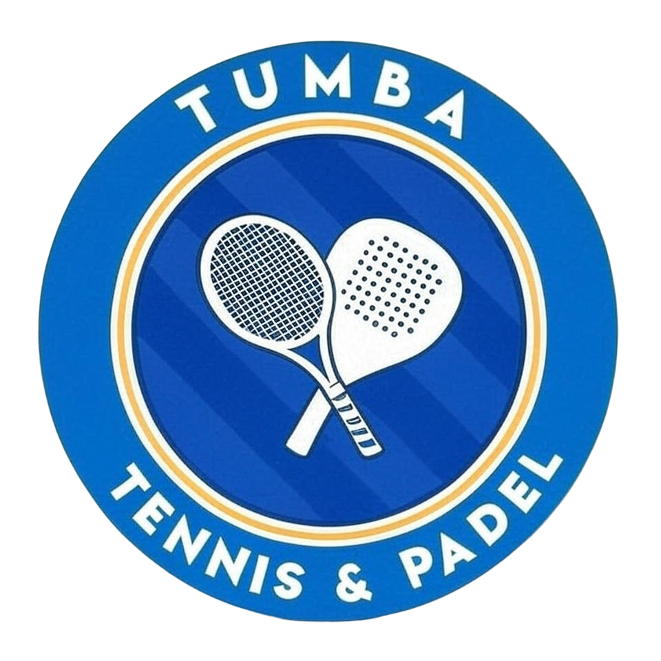

# Tumba Tennis & Padel

Modern, snabb och redaktörsvänlig webbplats för Tumba TK

{width=50}{height=20}

### Live demo
Frontend → https://tumba-tennis-padel.vercel.app *(deployas snart)*  
API → https://tumba-tennis-padel.up.railway.app *(deployas snart)*  
Redigera innehåll → https://tumba-tennis-padel.sanity.studio

### Tech Stack
| Del            | Teknik                              | Varför valt?                                    |
|----------------|-------------------------------------|-------------------------------------------------|
| Frontend       | React 18 + TypeScript + Vite        | Snabb, modern och standard 2025                 |
| Styling        | Tailwind CSS                        | Responsiv, lätt att ändra                       |
| CMS            | Sanity.io (headless)                | Klubben kan redigera text/bilder utan kod       |
| Backend        | .NET 8 Minimal API                  | Skalbar, säker,                                 |
| Deploy         | Vercel (frontend) + Railway (API)   | Gratis, auto-deploy från GitHub                 |
| Container      | Docker Compose                      | Lokal utveckling = produktion                   |

### Varför ett separat .NET API?
- Förberedd för framtida funktioner (bokning, betalningar, medlemssystem)
- Bättre säkerhet och skalbarhet än att fetcha direkt från frontend

### Kom igång lokalt
```bash
# Frontend
cd client
npm run dev

# Backend
cd api
dotnet watch

# Allt på en gång (rekommenderas)
docker compose up --build
